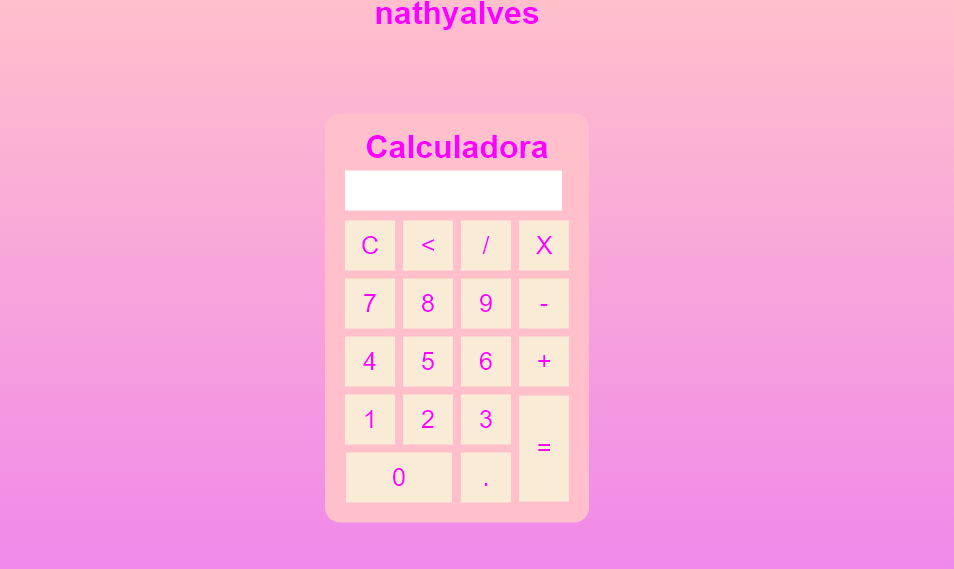

# calculadora1

Este é o primeiro projeto que criei com base em conhecimentos adquiridos na faculdade e em cursos do youtube. É uma calculadora bem simples construída utilizando conceitos básicos de HTML, CSS e Javascript. Ela possui funções de soma, subtração, divisão e multiplicação.

Acesse aqui: https://nathyalves.github.io/calculadora1/
